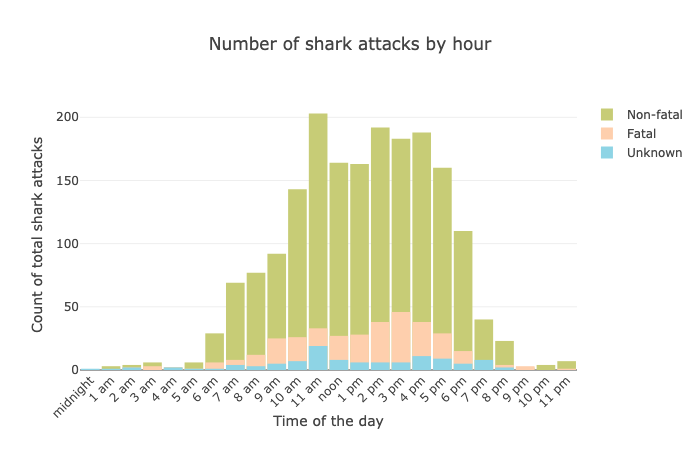
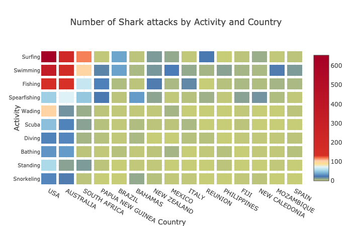
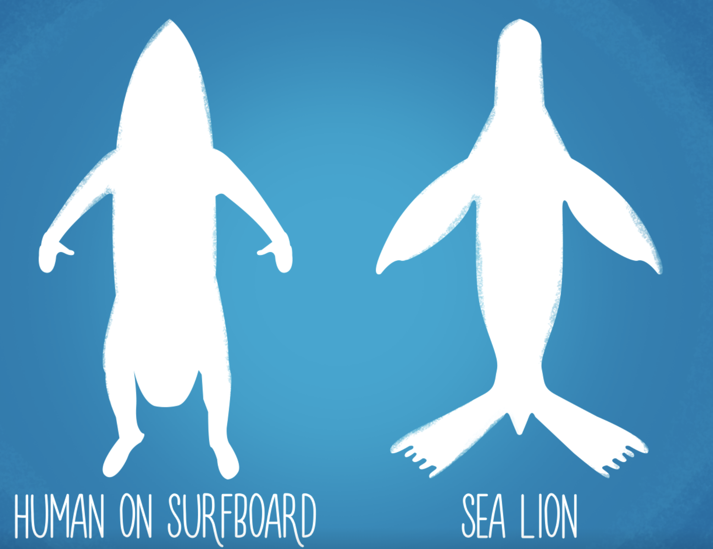

# How dangerous are sharks?
Data Visualization Final Project. I'm analyzing shark attacks data from [Global Shark Attack File](http://www.sharkattackfile.net/)

#### See full story with many more various plots and cool visuals:
* [Analysis with interactive Plotly charts](https://nbviewer.jupyter.org/github/katjawittfoth/Data_Viz/blob/master/Notebooks/Shark%20Attacks.ipynb)

# Few insights
Most people are afraid of sharks, and there's a misconception that if you are in the water with them you are in deep trouble. The idea that sharks are killing machines preying on humans is a myth that I learned to overcome after I became an avid scuba diver. I’m often diving in the murky waters of Northern California, which is famous for its large population of White Sharks, so I wanted to learn more about real risks.

 

Generally, shark attacks are increasing, though the fatal attacks are staying at the same level throughout the century. 
You can see a peak of attacks around 1960. The peak happens in the USA and Australia, driven by surfing starting to get popular in the 60s.

  We know that sharks hunt at dawn and dusk. If sharks prey on humans, we should see a peak of attacks around dusk and dawn.

 

Not true! Obviously, humans are not part of sharks’ diet and the attacks happen when people are enjoying the beach time.

 

Surfing in the USA and Australia seems to be by far the most dangerous activity. Sharks often mistake surfers or humans splashing in the water for prey. 
Another interesting fact is that sharks are getting confused and overwhelmed by a present of dead fish, thus a large number of shark attacks are happening when people are fishing and spearfishing.
 

 

[More plots in my Notebook](https://nbviewer.jupyter.org/github/katjawittfoth/Data_Viz/blob/master/Notebooks/Shark%20Attacks.ipynb)
Click in the top of the Notebook to toggle on/off the raw code
