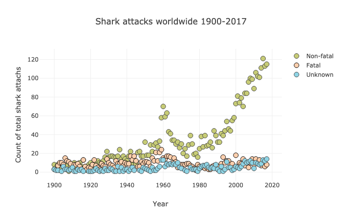

Data Visualization Project on Shark Attack Data

# How dangerous are sharks and is all the fear people have justified?
Analyzing shark attacks data from [Global Shark Attack File](http://www.sharkattackfile.net/)

Most people are afraid of sharks, and there's a misconception that if you are in the water with them you are in deep trouble. The idea that sharks are killing machines preying on humans is a myth that I learned to overcome after I became an avid scuba diver, but I've only had two encounters with sharks so far. I’m often diving in the murky waters of Northern California, which is famous for its large population of White Sharks, so I wanted to learn more about the attacks and real risks.

### Dataset
I am using shark attack incidents dataset from Kaggle: 
https://www.kaggle.com/teajay/global-shark-attacks. This data was compiled by the Global Shark Attack File. 

Let’s take a look at the general development of shark attacks from 1900 to 2017.

	

We can see that shark attacks are increasing, though the fatal attacks are staying at the same level throughout the century, at about average of 9.2 number of fatal attacks globally per year. This number doesn’t change much by decade either.
If you look at the shark attacks development, especially non-fatal ones, you can see a peak around 1960. The peak happens in the USA and Australia, driven by surfing starting to get popular in the 60s.

...

#### See many more various plots and cool visuals in the Jupyter Notebook.
